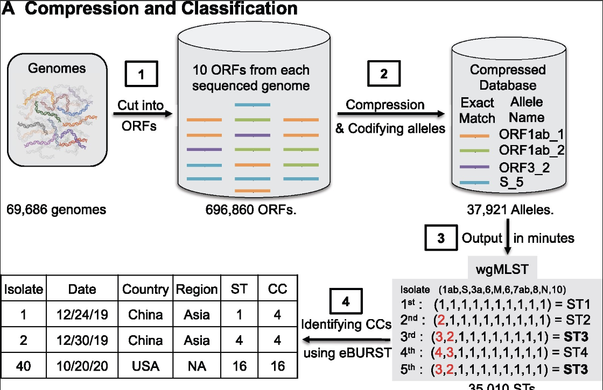

# Microbial Genomics Journey Workshop 2023
## Session 5: Blast database and Typing/MLST

## Molecular typing
Molecular typing methods can be used to investigate the local epidemiology of a disease outbreak by determining the degree of similarity between the various isolates recovered from an outbreak. Moreover, the global epidemiology of an agent can be checked for differences between strains causing disease in one geographic area to those isolated from other areas. The most important aspect about the methods used in local and global epidemiological investigations is to be able to discriminate between closely and distantly related isolates. Isolates assigned to the same molecular type should be descended from a recent and common ancestor while isolates that share a more distant common ancestor should not be assigned to the same type.<br/>

## blast
The Basic Local Alignment Search Tool (BLAST) finds regions of local similarity between sequences. The program compares nucleotide or protein sequences to sequence databases and calculates the statistical significance of matches. BLAST can be used to infer functional and evolutionary relationships between sequences as well as help identify members of gene families. You can check available NCBI databases from [here](https://www.ncbi.nlm.nih.gov/guide/all/).<br/>
**GenBank**
The NIH genetic sequence database, an annotated collection of all publicly available DNA sequences.<br/>
**RefSeq**
A collection of curated, non-redundant genomic DNA, transcript (RNA), and protein sequences produced by NCBI. RefSeqs provide a stable reference for genome annotation, gene identification and characterization, mutation and polymorphism analysis, expression studies, and comparative analyses. The RefSeq collection is accessed through the Nucleotide and Protein databases.<br/>


Let's make our blast database!
```
conda activate blast
cat ../outputs/annot_genome3/genome3.faa ../outputs/annot_genome4/genome4.faa > genomes_3_4_combined.faa
makeblastdb -in genomes_3_4_combined.faa -title test_blast_db -dbtype prot
blastp -query Two_genes.faa -db genomes_3_4_combined.faa -max_target_seqs 5 -outfmt '6 qseqid sacc evalue qcovs pident' -out Two_genes_output.txt
less Two_genes_output.txt
```
## MLST
Multilocus Sequence Typing (MLST) uses slowly accumulated variations in the population (likely to be selectively neutral). Only a small number of alleles can be identified within the population by using this type of variation. However, high levels of discrimination are achieved by analysing many loci (Maiden et al., 1998). Multilocus sequence typing methods sequence the internal fragments of housekeeping genes.<br/>

### Why is that classification?
Strain variations and the impact on virulence, pathogensis and other phenotypes. Also, humans like to name/classify things as much as they can. A detailed understanding of the diversity of a microbial species is critical for identifying emerging variants and monitoring dynamic spread around the globe. We use this system to show multiple waves of expansion and replacement of variants over time, including multiple introductions of variants both internationally and from more local sources. This approach allows straightforward measurements of the diversity of the microbial species of interest. Some examples:

* SARS-CoV-2 different variants.
* Livestock-associated methicillin-resistant Staphylococcus aureus (MRSA) belonging to CC398.
* IBD-associated Klebsiella pneumoniae ST323

[MLST](https://github.com/tseemann/mlst) is a tool for screening contig files against traditional [PubMLST](https://pubmlst.org/) typing schemes.
```
conda activate mlst
cd ~/MGJW/problem_set4/abricate_genomes
mlst genome4.fasta
```
### Limitation
Quoted from my thesis "The MLST technique was not able to differentiate between the strains from Pakistan and Thailand as all of the tested isolates (n = 21) were sequence type (ST) 122. The PFGE technique showed a difference of one band between the Thai and Pakistani isolates."
## GNUVID
GNU-based Virus IDentification [GNUVID] is a tool that integrates whole-genome multilocus sequence typing and a supervised machine learning random forest-based classifier to classify SARS-CoV-2 genomes.
Figure showing the concepts!


## Further Readings
* [Misunderstood parameter of NCBI BLAST impacts the correctness of bioinformatics workflows](https://academic.oup.com/bioinformatics/article/35/9/1613/5106166?login=true) Take care of how you use max_target_seqs.
* [Review: Typing methods based on whole genome sequencing data](https://onehealthoutlook.biomedcentral.com/articles/10.1186/s42522-020-0010-1)
* [BLAST Command Line Applications User Manual](https://www.ncbi.nlm.nih.gov/books/NBK279690/)
