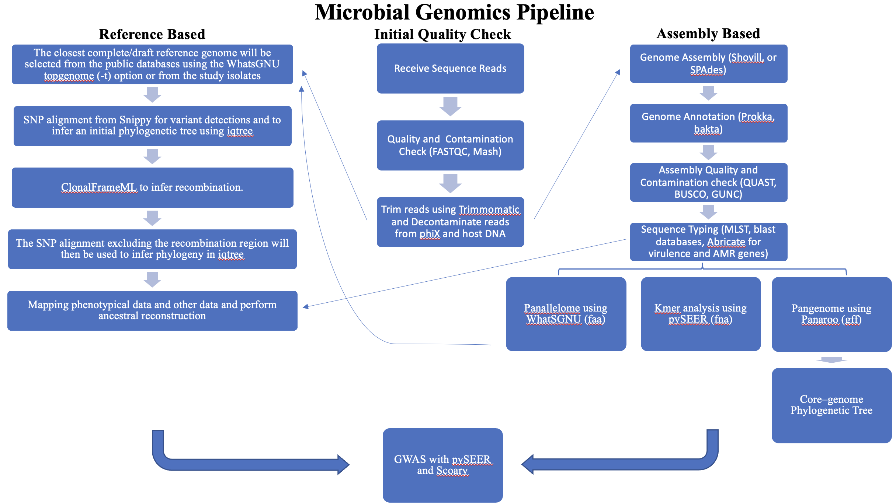

# Microbial Genomics Journey Workshop 2023
## Session 12: Mobile genetic elements, Workflows and Pipelines

### Teaching Evaluations
Please evaluate my teaching!<br/>
To start the survey, you may use either of the two choices (the Survey Access Code or
the QR code), whichever you find easiest or quickest to use.
1. Please access this [Survey title: "Teaching Evaluations" link](https://redcap.chop.edu/surveys/). Then enter this code: WAE4YWJYK.
2. Teaching Evaluation QR Code


Please complete the survey below as follows.
* Division of Faculty Member (GI/Nutrition/Hepatology)
* Faculty Member (Ahmed M Moustafa)
* Type of teaching (Lectures/Discussions etc.)
* Date of Teaching (12-01-2023 or any other date during the workshop)
* Topic of Lecture (Microbial Genomics Journey Workshop-12 weeks)
* Your Position (put your position)
* Quality of this instructor (choose a value)
* Comments (optional but will be appreciated)

### updated knowledge map
We started this workshop with "Map your Microbial Genomics knowledge out". Knowledge mapping helps communicate information and solve complex problems. Now it is time to update your knowledge map with what we learnt in this workshop. Here is my version. You can access a powerpoint version of this Microbial genomics knowledge map [here](Knowledge_Map_2.pptx).<br/>


---

### phastest
[phastest](https://phastest.ca/)
PHASTEST (PHAge Search Tool with Enhanced Sequence Translation) is the successor to the PHAST and PHASTER prophage finding web servers. PHASTEST is available online at https://phastest.ca, as an API for programmatic queries, or as a Docker image for local installations. You can check publication [here](https://academic.oup.com/nar/article/51/W1/W443/7167344).

### PlasmidFinder
[PlasmidFinder](https://cge.food.dtu.dk/services/PlasmidFinder/). This tool identifies plasmids in complete or draft sequenced isolates of bacteria. It can be accessed through this website or installed locally using docker. Instructions can be found [here](https://bitbucket.org/genomicepidemiology/plasmidfinder/src/master/).

### geNomad
[geNomad](https://github.com/apcamargo/genomad). A tool for Identification of mobile genetic elements. Its primary goal is to identify viruses and plasmids in sequencing data (isolates, metagenomes, and metatranscriptomes).

#### Installation
`mamba create -n genomad -c conda-forge -c bioconda genomad`

#### Usage example
geNomad depends on a database that contains the profiles of the markers that are used to classify sequences, their taxonomic information, their functional annotation, etc. So, your first step is to download the database to your current directory or any other location on your computer<br/>
```
mamba activate genomad
genomad download-database .
```
The database will be contained within the genomad_db directory.<br/>
Using this  _K. pneumoniae_ genome [GCF_009025895.1](https://www.ncbi.nlm.nih.gov/datasets/genome/GCF_009025895.1/) as input. Generally, you can use any FASTA file containing nucleotide sequences as input. The tool will work for isolate genomes, metagenomes, and metatranscriptomes.

`genomad end-to-end --cleanup --splits 8 GCF_009025895.1.fna.gz genomad_output genomad_db`

The results will be written inside the genomad_output directory. Let's explore GCF_009025895.1_summary.tsv<br/>

### Nextflow
[Nextflow](https://www.nextflow.io/) enables scalable and reproducible scientific workflows using software containers. It allows the adaptation of pipelines written in the most common scripting languages.

#### CladeBreaker
[CladeBreaker](https://github.com/andriesfeder/cladebreaker) test the hypothesis of clonality by using the most similar genomes available in the database. If these genomes fail to break up the monophyly of the outbreak clade then this provides the strongest evidence possible for clonality.<br/>

#### Bactopia
[Bactopia](https://bactopia.github.io/v2.2.0/) is a flexible pipeline for complete analysis of bacterial genomes. The goal of Bactopia is process your data with a broad set of tools, so that you can get to the fun part of analyses quicker!

### Snakemake
The Snakemake workflow management system is a tool to create reproducible and scalable data analyses. Workflows are described via a human readable, Python based language. They can be seamlessly scaled to server, cluster, grid and cloud environments, without the need to modify the workflow definition. Finally, Snakemake workflows can entail a description of required software, which will be automatically deployed to any execution environment.

#### Sunbeam
[Sunbeam](https://github.com/sunbeam-labs/sunbeam) is a pipeline written in snakemake by Kyle Bittinger team that simplifies and automates many of the steps in metagenomic sequencing analysis. It can be deployed on most Linux workstations and clusters. To read more, check out their paper in [Microbiome](https://microbiomejournal.biomedcentral.com/articles/10.1186/s40168-019-0658-x).

### PFB
* [Programming for Biology Course](https://meetings.cshl.edu/courses.aspx?course=C-INFO&year=22) at Cold Spring Harbor Laboratory.
* Instructed by Simon Prochnik, Circularis Biotech Inc. and Sofia Robb, Stowers Institute for Medical Research.
* Designed for lab biologists with little or no programming experience, this course will give students the bioinformatic sand scripting skills they need to derive biological insights from this abundance of data.
* The only prerequisite for the course is a strong commitment to learning basic UNIX and a scripting language.
* Lectures and problem sets from previous years are available [online](https://github.com/prog4biol).
* They use Python and the course begins with one week of introductory coding, continues with practical topics in bioinformatics, with plenty of coding examples, and ends with a group coding project.

## Further Readings
* [DEFINITIONS REGARDING ISOLATE RELATIONSHIPS](https://www.sciencedirect.com/science/article/pii/S1198743X1463192X?via%3Dihub)
* [ChatGPT for bioinformatics](https://medium.com/@91mattmoore/chatgpt-for-bioinformatics-404c6d0817a1)
